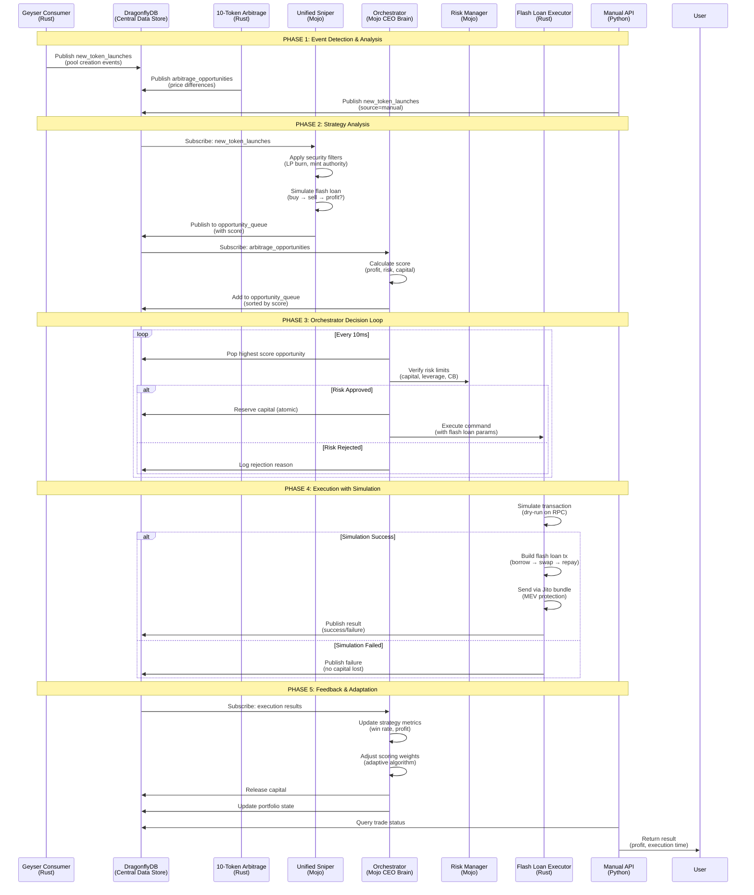

# Strategic Orchestrator Architecture Documentation

## Overview

The Strategic Orchestrator is the "CEO brain" of the MojoRust trading system, coordinating multiple trading strategies to operate on a unified Save protocol portfolio. It provides intelligent decision-making, resource management, and adaptive learning capabilities.

## Architecture Diagram



## Core Components

### 1. DragonflyDB (Central Data Store)

**Purpose**: High-performance Redis-compatible data store for real-time coordination

**Key Features**:
- Pub/Sub channels for event streaming
- Sorted sets for priority queues
- Atomic operations for capital reservations
- TTL-based data expiration

**Channels**:
- `new_token_launches` - Pool creation events from Geyser
- `arbitrage_opportunities` - Price discrepancy opportunities
- `opportunity_queue` - Priority-sorted trading opportunities
- `orchestrator_commands` - Execution commands for Rust layer
- `execution_results` - Trade execution results
- `capital_state` - Portfolio and capital allocation state

### 2. Geyser Data Consumer (Rust)

**Purpose**: Real-time Solana blockchain event detection and filtering

**Key Features**:
- Connects to Helius LaserStream for low-latency data
- Filters >99% of events to reduce noise
- Detects pool creation events from Raydium and Orca
- Publishes structured events to DragonflyDB

**Event Types**:
- `NewPoolCreation` - Generic pool creation
- `InitializePool` - Raydium AMM V4 initialization
- `CreateLiquidityPool` - Orca Whirlpool creation

### 3. 10-Token Arbitrage Scanner (Rust)

**Purpose**: Multi-DEX price monitoring and arbitrage opportunity detection

**Monitored Tokens**:
- SOL, USDC, USDT, BONK, JUP, WIF, PYTH, JTO, ORCA, RAY

**Monitored DEXes**:
- Raydium, Orca, Jupiter, Meteora

**Key Features**:
- Real-time price fetching from multiple DEXes
- Flash loan profitability calculation
- Dynamic slippage map updates
- Publishes opportunities to DragonflyDB

### 4. Unified Sniper Engine (Mojo)

**Purpose**: Consolidated memecoin sniping with security filtering and flash loan integration

**Security Filters**:
- Mint authority revoked verification
- LP burn threshold (90%+ required)
- Holder distribution analysis (top 5 < 30%)
- Creator blacklist checking
- Initial liquidity verification

**Profitability Analysis**:
- Flash loan simulation (borrow → buy → sell → repay)
- Jupiter API integration for swap simulation
- Fee calculation (Save 0.03% + DEX fees + slippage)
- Risk-adjusted confidence scoring

### 5. Strategic Orchestrator (Mojo) - CEO Brain

**Purpose**: Central decision-making and resource management

**Core Loop** (10ms intervals):
1. **Fetch Opportunity** - Get highest score from priority queue
2. **Risk Verification** - Check capital, leverage, circuit breakers
3. **Capital Allocation** - Atomic reservation in DragonflyDB
4. **Execution Command** - Send to Rust execution layer
5. **Feedback Processing** - Update metrics, release capital

**Scoring Algorithm**:
```
score = (w1 * profit) - (w2 * risk) - (w3 * capital_cost) + (w4 * strategy_bonus)
```

**Adaptive Learning**:
- Monitors strategy performance every 5 minutes
- Adjusts scoring weights based on win rates
- Boosts high-performing strategies
- Reduces weight for underperforming strategies

### 6. Risk Manager (Mojo)

**Purpose**: Multi-layer risk protection

**Risk Checks**:
- Available capital verification
- Flash loan daily limit enforcement
- Portfolio heat monitoring
- Leverage ratio limits
- Position concentration limits
- Circuit breaker status

## Data Flow

### 1. Event Detection Flow
```
Solana Blockchain → Helius LaserStream → Geyser Consumer → DragonflyDB
                                                    ↓
                                              Strategy Engines
```

### 2. Opportunity Processing Flow
```
Strategy Analysis → Scoring → Priority Queue → Risk Check → Capital Allocation → Execution
```

### 3. Feedback Loop
```
Execution Result → Metrics Update → Weight Adjustment → Portfolio State Update
```

## Configuration

### Orchestrator Settings
```toml
[orchestrator]
enabled = true
scoring_weights = { profit = 0.4, risk = 0.3, capital_efficiency = 0.2, strategy_bonus = 0.1 }
max_concurrent_opportunities = 10
opportunity_timeout_seconds = 30
capital_allocation_strategy = "dynamic"
decision_loop_interval_ms = 10
adaptive_learning_enabled = true
portfolio_heat_limit = 0.8
max_leverage_ratio = 3.0
```

### Sniper Settings
```toml
[sniper.memecoin]
enabled = true
use_flash_loan = true
max_flash_loan_amount_sol = 50
filters.lp_burn_threshold_bps = 9000
filters.mint_authority_revoked = true
filters.max_top5_holder_percent = 30
filters.min_initial_liquidity_sol = 5000
simulation.enabled = true
simulation.timeout_ms = 100
target_profit_multiplier = 2.0
```

### Arbitrage Settings
```toml
[arbitrage.ten_token]
enabled = true
monitored_tokens = [...]  # 10 major tokens
monitored_dexes = ["raydium", "orca", "jupiter", "meteora"]
scan_interval_ms = 500
min_profit_threshold_sol = 0.05
use_flash_loan = true
max_flash_loan_amount_sol = 100
```

## Performance Characteristics

### Latency Targets
- **Event Detection**: <50ms from blockchain to DragonflyDB
- **Opportunity Scoring**: <10ms processing time
- **Risk Verification**: <5ms per check
- **Total Decision Time**: <30ms from queue to execution

### Throughput
- **Geyser Events**: 100,000+ events/sec processed
- **Opportunities**: 1,000+ scored per minute
- **Executions**: Up to 10 concurrent operations
- **API Calls**: 500+ per second with caching

### Memory Usage
- **Opportunity Queue**: ~10MB (10,000 opportunities)
- **Price Cache**: ~50MB (real-time prices)
- **Metrics Storage**: ~100MB per day
- **Total System**: <500MB baseline

## Safety Mechanisms

### 1. Circuit Breakers
- **Maximum Drawdown**: 15% portfolio loss triggers halt
- **Consecutive Losses**: 5 failed trades triggers pause
- **Daily Loss Limit**: 10% daily loss threshold
- **Flash Loan Limit**: Daily usage cap

### 2. Capital Protection
- **Atomic Reservations**: Capital locked during execution
- **Timeout Protection**: 5-minute reservation expiry
- **Slippage Limits**: Maximum 5% slippage tolerance
- **Simulation Required**: Dry-run before all executions

### 3. Risk Management
- **Position Limits**: Maximum 10 concurrent positions
- **Leverage Caps**: 3x maximum leverage ratio
- **Concentration Limits**: 30% maximum single position
- **Portfolio Heat**: 80% allocation threshold

## Monitoring and Observability

### Key Metrics
- **Opportunity Flow**: Queue size, processing rate, rejection rate
- **Strategy Performance**: Win rate, profit factor, execution time
- **Capital Utilization**: Available vs allocated capital
- **Risk Metrics**: Portfolio heat, leverage ratio, drawdown

### Health Checks
- **DragonflyDB Connectivity**: Pub/Sub subscription status
- **Strategy Engine Health**: Analysis latency, error rates
- **Execution Layer**: Transaction success rates, confirmation times
- **System Resources**: CPU, memory, network I/O

## API Endpoints

### Manual Targeting API
```bash
POST /api/v1/sniper/analyze
{
  "token_mint_address": "...",
  "strategy": "flash_loan_snipe"
}

POST /api/v1/sniper/execute
{
  "trade_id": "uuid"
}

GET /api/v1/sniper/status/{trade_id}
GET /api/v1/sniper/pending
```

### Health Endpoints
```bash
GET /health                    # System health
GET /metrics                   # Prometheus metrics
GET /api/v1/status            # Orchestrator status
GET /api/v1/portfolio/snapshot # Portfolio state
```

## Deployment

### Startup Sequence
1. **Environment Validation** - Check required variables
2. **DragonflyDB Connection** - Verify connectivity
3. **Data Consumer** - Start Geyser stream processing
4. **Arbitrage Scanner** - Start price monitoring
5. **Manual API** - Start targeting service (optional)
6. **Strategic Orchestrator** - Start CEO brain

### Graceful Shutdown
- SIGINT/SIGTERM handling
- Wait for in-flight transactions
- Release capital reservations
- Close DragonflyDB connections
- Cleanup temporary files

## Troubleshooting

### Common Issues

**High Memory Usage**
- Check opportunity queue size
- Verify TTL settings are working
- Monitor DragonflyDB memory

**Slow Processing**
- Check DragonflyDB latency
- Verify strategy engine performance
- Monitor network connectivity

**Execution Failures**
- Check RPC node health
- Verify flash loan protocol availability
- Monitor Jupiter API status

**Low Success Rate**
- Review risk thresholds
- Check scoring weights
- Analyze strategy performance

### Debug Commands
```bash
# Check DragonflyDB connection
redis-cli -u $REDIS_URL ping

# Monitor opportunity queue
redis-cli -u $REDIS_URL zcard opportunity_queue

# Check portfolio state
redis-cli -u $REDIS_URL get portfolio_state

# View logs
tail -f logs/strategic_orchestrator.log
```

## Future Enhancements

### Planned Features
- **Machine Learning Integration**: Advanced pattern recognition
- **Cross-Chain Arbitrage**: Multi-chain opportunity detection
- **Social Trading**: Copy successful strategies
- **Advanced Analytics**: Deeper performance insights
- **Mobile Dashboard**: Real-time monitoring app

### Scalability Improvements
- **Horizontal Scaling**: Multiple orchestrator instances
- **Database Sharding**: Distribute load across DragonflyDB nodes
- **Edge Computing**: Local processing for reduced latency
- **GPU Acceleration**: Enhanced calculation performance

This architecture provides a robust, scalable, and intelligent trading system that coordinates multiple strategies on a unified Save protocol portfolio with comprehensive risk management and adaptive learning capabilities.